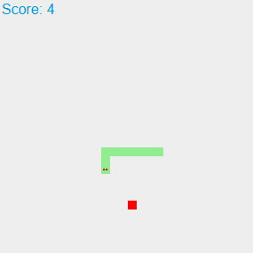
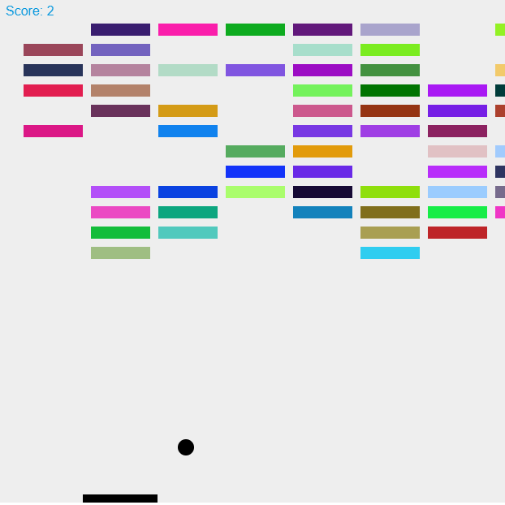
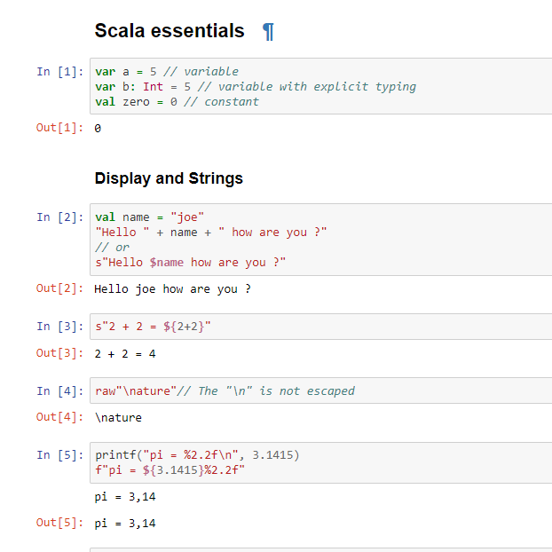

A non-exhaustive list of open-source projects to which I have contributed.

<link rel="stylesheet" href="https://stackpath.bootstrapcdn.com/bootstrap/4.3.1/css/bootstrap.min.css" integrity="sha384-ggOyR0iXCbMQv3Xipma34MD+dH/1fQ784/j6cY/iJTQUOhcWr7x9JvoRxT2MZw1T" crossorigin="anonymous">

<link rel="stylesheet" href="../css/projects.css">

  

    

      

        
      

      

        <h2 class="card-title">Clustering4Ever</h2>
        
A Big Data Clustering Library gathering clustering, unsupervized algorithms, and quality indices.

        <a href="https://github.com/Clustering4Ever/Clustering4Ever" class="btn btn-primary btn-sm">Go</a>
      

    

  

  

    

    

      
      

      

        <h2 class="card-title">Snake Scala.js</h2>
        
A simple reproduction of the snake game made with Scala.js library.

        <a href="https://riiswa.github.io/snake-scala.js/" class="btn btn-primary btn-sm">Go</a>
      

    

  

  

    

    

      
      

      

        <h2 class="card-title">Break-Out Scala.js</h2>
        
A simple reproduction of the break-out game made with Scala.js library.

        <a href="https://riiswa.github.io/breakout-scala.js/" class="btn btn-primary btn-sm">Go</a>
      

    

  

  

    

    

      
      

      

        <h2 class="card-title">The Biggest Scala Cheat Sheet</h2>
        
A big (very big) cheat sheet on the basic notions of scala.

        <a href="https://riiswa.github.io/Scala-CheatSheet/" class="btn btn-primary btn-sm">Go</a>
      

    

  

  

    

    

      
      

      

        <h2 class="card-title">Ant Colony Simulator</h2>
        
An intelligent ant colony simulation that shows how ants search for food in their environments

        <a href="https://github.com/riiswa/colony-ant-simulator" class="btn btn-primary btn-sm">Go</a>
      

    

  

  

    

    

      
      

      

        <h2 class="card-title">ScalaMaze</h2>
        
A little library that implement some procedural maze generation algorithm in Scala.

        <a href="https://github.com/riiswa/ScalaMaze" class="btn btn-primary btn-sm">Go</a>
      

    

  

  

